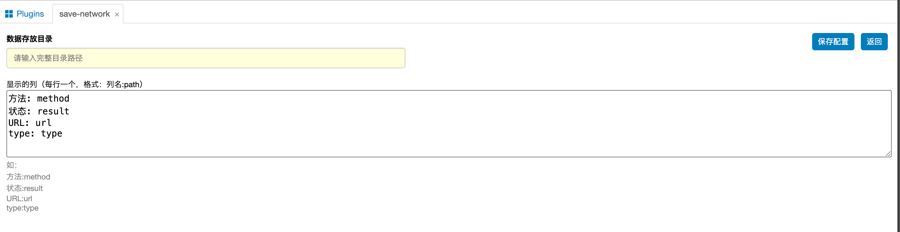
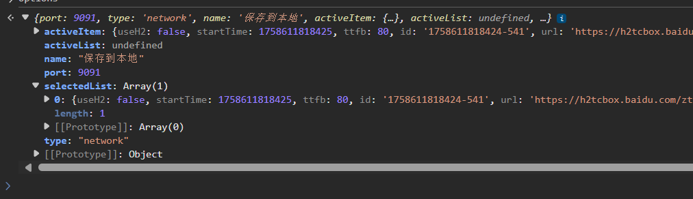

# whistle.save-network

感谢 [whistle](https://github.com/avwo/whistle) 开发者, 非常好用的工具, 也学到了很多 js 的知识

```
npm install @msyize/whistle.save-network -g
```

## 截图




## Warn

- 如果开发中, 发现接口无法访问, 并且插件中没有日志, 那记得改下package中的name, 并重新启动插件,配置rule;
- 优先用 npm 安装的 whistle 去调试, 看log 比较方便, client 某些情况下, 不出log;
- 数据文件在用户目录下: .WhistleAppData
- 自定义证书需要通过 p12 文件生成 crt 文件和 key 文件: 然后重命名为 root.crt 和 root.key, 放到.WhistleAppData\custom_certs


## options 数据示例




## 源码安装:

```shell
npm install
npm install . -g
```

